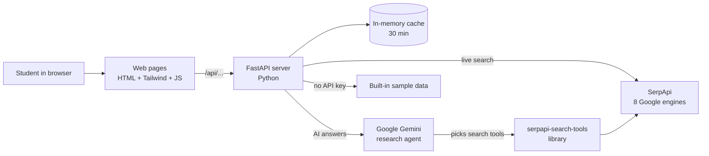
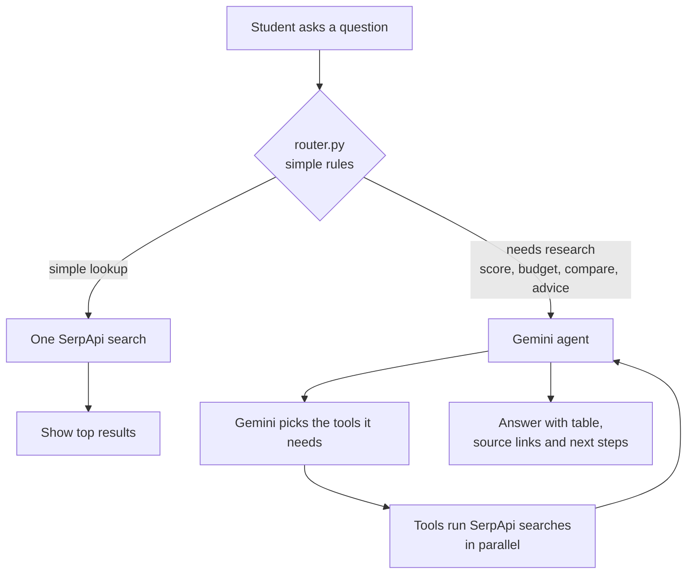

# LearnBeacon Architecture

LearnBeacon has three parts: a set of web pages that students use, a Python server, and the outside services the server calls for live data and AI answers.

## The big picture



1. The student opens a page in the browser.
2. The page calls the server's API (`/api/...`).
3. The server gets live results from SerpApi, or asks Gemini to research a question. When Gemini researches, its web, news, maps and video searches go through SerpApi's official `serpapi-search-tools` library.
4. The server returns clean JSON, and the page shows it as cards, maps, charts or an answer.

One server does both jobs: it serves the web pages and the API, so everything runs from a single address (http://127.0.0.1:8000).

## The parts

### 1. Frontend (what students see)

Plain HTML pages with no build step.

| Page | File | Shows |
|---|---|---|
| Dashboard | `index.html` | AI question box and latest news |
| Explore Colleges | `colleges.html` | Colleges on a map, with a list |
| Learn Hub | `learn.html` | News, videos, books, research papers, trends |
| Scholarships | `scholarships.html` | Scholarship search results |
| Careers | `careers.html` | Options after 10th/12th/degree, jobs, videos, AI advice |

All pages share three scripts:
- `js/api.js` calls the server.
- `js/render.js` turns data into HTML, maps and charts.
- `js/main.js` connects each page to the right data.

Libraries: Tailwind CSS (styling), Leaflet + OpenStreetMap (maps), Chart.js (trend charts), marked + DOMPurify (shows the AI answer safely).

### 2. Backend (the server)

| File | Job |
|---|---|
| `main.py` | All API routes, the SerpApi helper, the cache and the sample data |
| `router.py` | Decides whether a question needs a quick search or the AI agent |
| `agent.py` | The AI research agent (Gemini + search tools) |
| `search_tools.py` | The agent's web, news, maps and video searches, through SerpApi's `serpapi-search-tools` library |
| `careers.py` | Fixed career paths for each education level (no API calls) |

### 3. Outside services

| Service | Used for |
|---|---|
| **SerpApi** | Live data from 8 engines: `google`, `google_maps`, `google_news`, `youtube`, `google_trends`, `google_play_books`, `google_scholar`, `google_jobs` |
| **`serpapi-search-tools`** (SerpApi's Python library) | The agent's web, news, maps and video searches (`web_search`, `news_search`, `maps_search`, `videos_search`). Other agent tools and the pages use our own SerpApi helper |
| **Google Gemini** (free tier) | The AI agent that plans searches and writes the answer |

There is no database and no login. Keys live in `backend/.env`.

## How a question is answered

When a student asks a question on the Dashboard:



- **Quick search:** a short question like "COEP Pune fees" gets one search. No AI is used, so it's fast and cheap.
- **AI agent:** a question like "97 percentile, CS colleges in Pune under ₹2L, any scholarships?" goes to Gemini. Gemini chooses tools (colleges, scholarships, news and so on), reads the results and writes one answer.
- **Live steps:** the server streams each step to the page as it happens (Server-Sent Events), so the student sees "Searching scholarships…", "Finding colleges…" before the answer.
- **Limits:** at most 6 searches and 5 Gemini calls per question.
- **Grounded answers:** Gemini may only use facts from the search results and must link a source for each one.

## Reliability and cost

| Situation | What happens |
|---|---|
| Same search again within 30 minutes | Served from the cache, no SerpApi credit used (trends: 6 hours) |
| No SerpApi key | Every page uses built-in sample data and shows a **Mock Data** badge |
| No Gemini key | The Dashboard falls back to a plain search |
| A search tool fails | The agent is told, and it answers with what it has |
| The `serpapi-search-tools` library fails | The tool falls back to our own SerpApi helper |

## Folder layout

```
LearnBeacon/
  backend/     Python server (FastAPI), agent and search tools
  frontend/    HTML pages and JavaScript
  docs/        Screenshots
  README.md    Project overview
  PROJECT.md   Full API reference, feature tracker and change log
```
