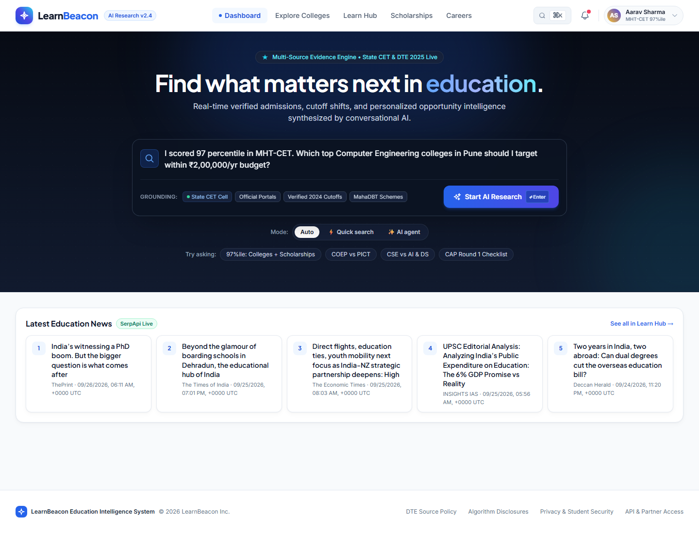
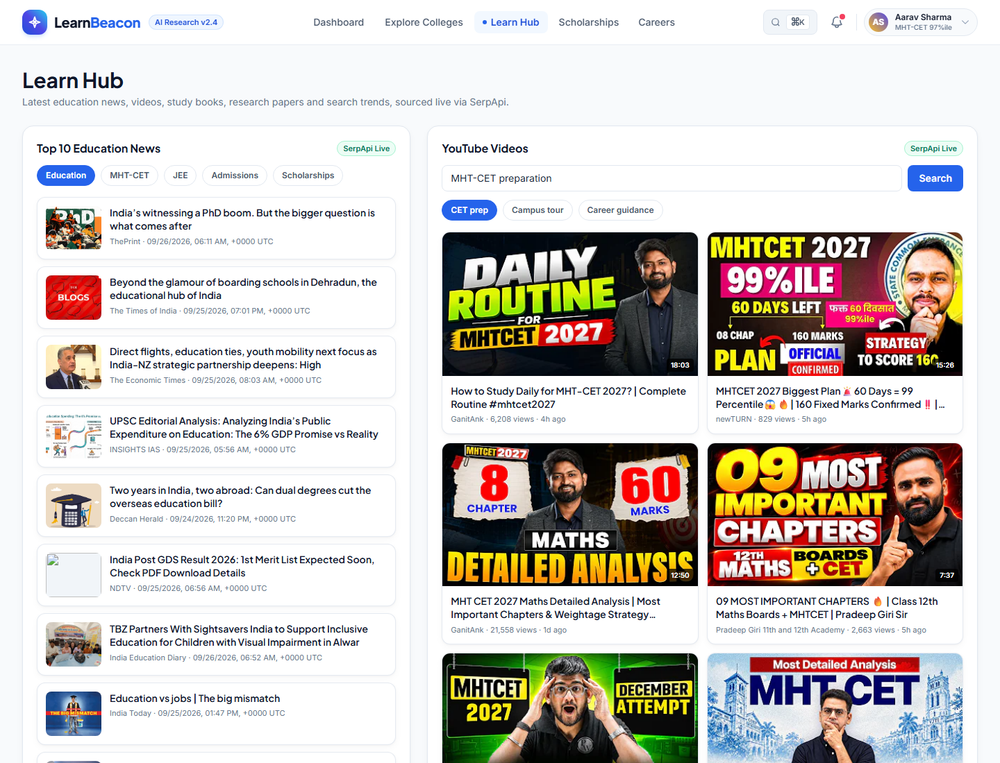
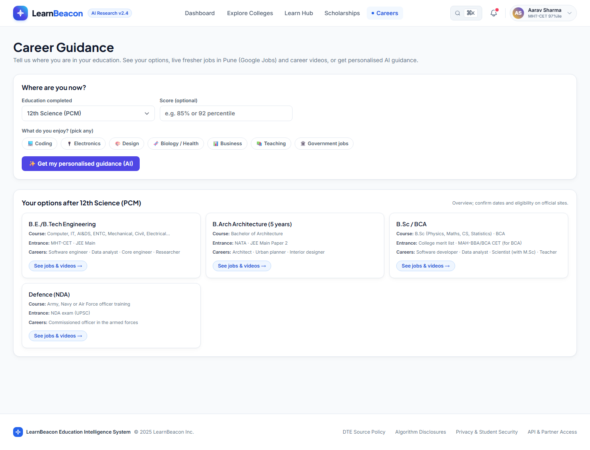
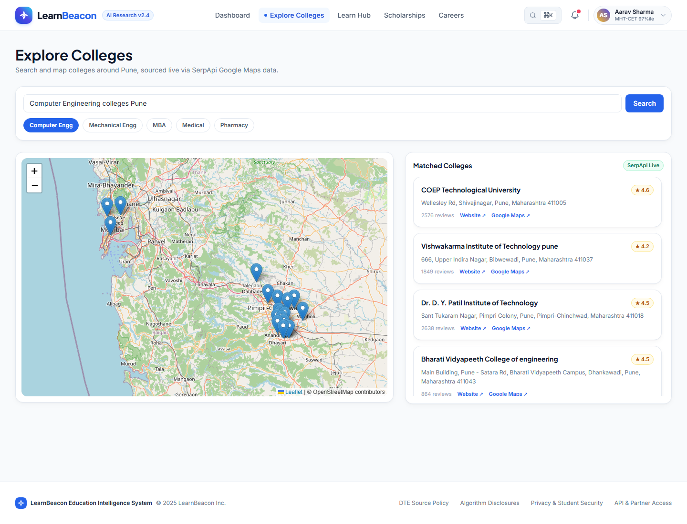
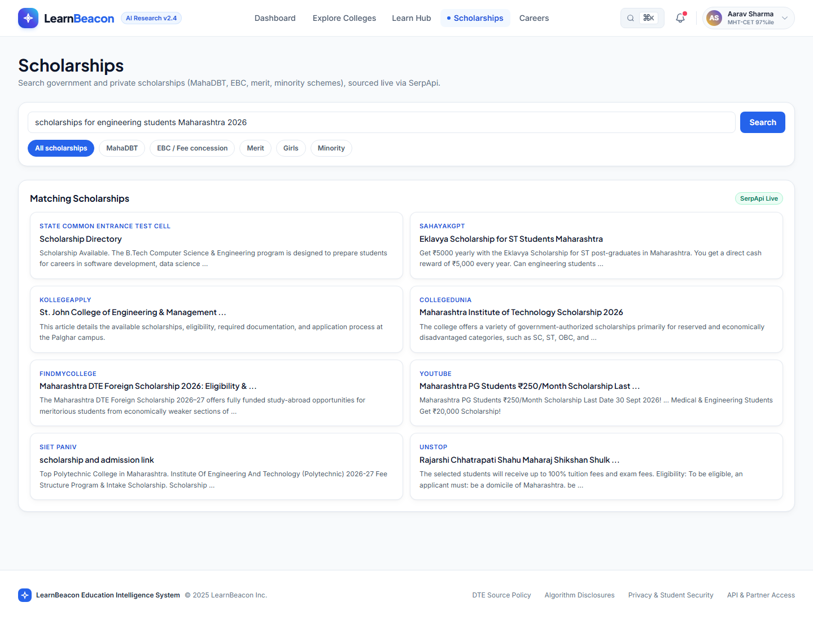
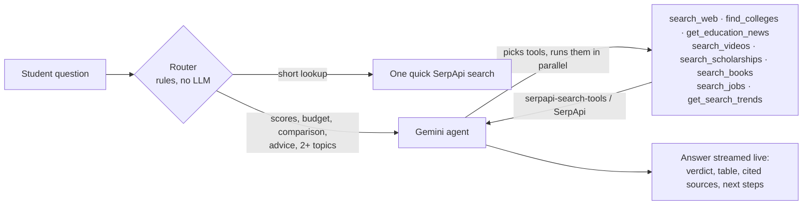

# LearnBeacon

**LearnBeacon is an AI research assistant for engineering aspirants in India, starting with Maharashtra (MHT-CET and JEE). It combines live search data from SerpApi with a Gemini research agent, so students can compare engineering colleges, find scholarships, prepare for entrance exams and plan their careers, with a source link for every fact.**

Every year, lakhs of students in India choose an engineering college after MHT-CET or JEE. To decide, they piece together cutoffs, fees, college ratings, scholarship rules, prep material and placement prospects from college websites, exam portals, news, YouTube, bookstores and job sites. LearnBeacon brings this research into one place. A student asks one question, for example _"97 percentile in MHT-CET, Computer Engineering in Pune under ₹2 lakh a year, any scholarships?"_. The agent searches several sources at once, compares the options and answers with a table, sources and next steps.

🎥 **Demo video:** https://youtu.be/Mkzj8lA4yRc · 📂 **Repo:** https://github.com/vrush1588/LearnBeacon

**Hackathon track:** Knowledge & Public Interest (Education), with an AI Agents angle.



## What students can do

| Page | What it does | SerpApi engines |
|---|---|---|
| **Dashboard** | Ask a question in plain language. An AI agent (Gemini) picks its own search tools, shows each step live, and answers with a comparison table, a source link for every fact, map links and next steps. Short lookups get a fast single search with no LLM call. | Agent tools: `google`, `google_maps`, `google_news`, `youtube`, `google_play_books`, `google_jobs`, `google_trends` |
| **Explore Colleges** | Colleges on a map with rating, reviews, website and Google Maps link. | `google_maps` |
| **Learn Hub** | Latest education news, prep videos with an in-page player, study books with prices, research papers with citations and PDFs, and exam search trends. | `google_news`, `youtube`, `google_play_books`, `google_scholar`, `google_trends` |
| **Scholarships** | Search MahaDBT, EBC, merit, girls' and minority schemes, with official links. | `google` |
| **Careers** | Students pick what they've completed (10th, 12th PCM/PCB/Commerce/Arts, diploma, B.E./B.Tech or another degree) and their interests. They see their options (course, entrance exams, careers), live fresher jobs in Pune with salaries and apply links, career videos, and personalised AI guidance. | `google_jobs`, `youtube`, plus the agent |

**8 SerpApi engines in use:** `google`, `google_maps`, `google_news`, `youtube`, `google_trends`, `google_play_books`, `google_scholar`, `google_jobs`.

**SerpApi's `serpapi-search-tools` library:** the AI agent's web, news, maps and video searches, and the Dashboard Quick search, go through SerpApi's official [`serpapi-search-tools`](https://serpapi.github.io/serpapi-search-tools-python/) Python library (`web_search`, `news_search`, `maps_search`, `videos_search`). See [`backend/search_tools.py`](backend/search_tools.py).

| Learn Hub | Careers |
|---|---|
|  |  |
| **Explore Colleges** | **Scholarships** |
|  |  |

## How the AI agent works

For the full system design (pages, server, SerpApi, Gemini and fallbacks), see [ARCHITECTURE.md](ARCHITECTURE.md).



- **The router decides first.** `router.py` sends a question to the agent only when it needs one: personal details (percentile, budget, category), a comparison, a request for advice, or several topics. Everything else gets one quick search, which saves search credits and Gemini quota. A Mode switch lets the student override it.
- **The agent loop is written by hand**, so every tool call streams to the page as it happens. It has a budget of 6 tool calls and 5 model calls per question.
- **Answers are grounded.** The agent may only state facts found in tool results, must cite each one, and must say when data (such as exact cutoffs) is missing.
- **It never breaks:**
  - A failed tool is reported to the model, which answers with what it has.
  - If the library fails, the tool falls back to our own SerpApi helper.
  - With no Gemini key, the Dashboard falls back to plain search.
  - With no SerpApi key, every page runs on built-in sample data (**Mock Data** badge).
- **It saves credits:** every SerpApi response is cached for 30 minutes (6 hours for trends), so repeat searches cost nothing.

## Run it

Requirements: Python 3.10+, a [SerpApi key](https://serpapi.com/users/sign_up), and optionally a free [Gemini API key](https://aistudio.google.com) for the AI agent.

```bash
cd backend
python -m venv venv
venv\Scripts\activate            # Windows (source venv/bin/activate on macOS/Linux)
pip install -r requirements.txt
copy .env.example .env            # cp on macOS/Linux; then set SERPAPI_KEY= and GEMINI_API_KEY=
uvicorn main:app --reload
```

Open http://127.0.0.1:8000. The API docs are at http://127.0.0.1:8000/docs.

- Leave `SERPAPI_KEY` empty to try every page with sample data, using no credits.
- Leave `GEMINI_API_KEY` empty to run without the agent.

## Built with

FastAPI (Python) · SerpApi and `serpapi-search-tools` · Google Gemini (`google-genai`, free tier) · static HTML, Tailwind CSS and vanilla JS · Leaflet with OpenStreetMap · Chart.js

## Limitations

- Exact cutoffs and fees come from web results, not an official database, so the agent says when it can't confirm them. Career path cards are an overview and ask students to confirm on official sites.
- The header isn't fully responsive on phone widths yet.
- The student profile in the header is a placeholder; there's no login.

See [PROJECT.md](PROJECT.md) for the full API reference, project structure and feature tracker.
